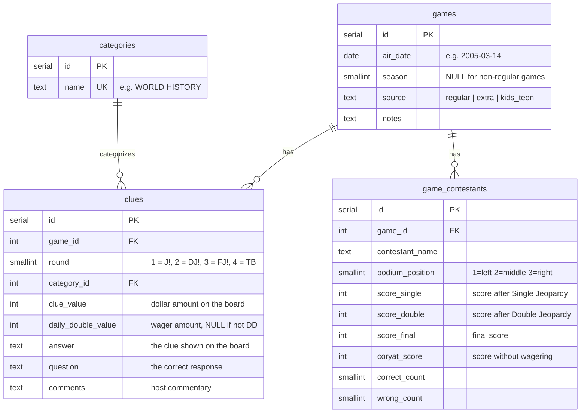

# Jeopardy Dataset — Data Guide

## Overview

This database contains **560K+ Jeopardy! clues** spanning seasons 1–41 (1984–2024), along with contestant scoring data for regular-season games. The data comes from the [jeopardy_clue_dataset](https://github.com/jwolle1/jeopardy_clue_dataset/releases/tag/v41).

## Entity Relationship Diagram



## Tables

### `categories`

A deduplicated list of every category name that has appeared on the show. There are **57K+** unique categories.

| Column | Type | Description |
|--------|------|-------------|
| `id` | serial | Primary key |
| `name` | text | Category name exactly as shown on the board, e.g. `"POTENT POTABLES"` |

### `games`

One row per game, identified by its air date and source type.

| Column | Type | Description |
|--------|------|-------------|
| `id` | serial | Primary key |
| `air_date` | date | Broadcast date |
| `season` | smallint | Season number (1–41). `NULL` for extra and kids/teen games |
| `source` | text | `regular` — standard season games (~9.1K games) |
| | | `extra` — unaired pilots, special events (~370 games) |
| | | `kids_teen` — Kids/Teen tournament games (~460 games) |
| `notes` | text | Additional context (rarely populated) |

### `clues`

The core table. Each row is one clue from a game board.

| Column | Type | Description |
|--------|------|-------------|
| `id` | serial | Primary key |
| `game_id` | int | FK → `games.id` |
| `round` | smallint | `1` = Jeopardy!, `2` = Double Jeopardy!, `3` = Final Jeopardy!, `4` = Tiebreaker |
| `category_id` | int | FK → `categories.id` |
| `clue_value` | int | Dollar value on the board. `0` for Final Jeopardy |
| `daily_double_value` | int | The contestant's wager if this was a Daily Double. `NULL` otherwise |
| `answer` | text | The "answer" — i.e. the clue text shown to contestants |
| `question` | text | The "question" — i.e. the correct "What is..." response |
| `comments` | text | Host commentary, e.g. `(Alex: ...a good year.)` |

> **Jeopardy terminology note:** The show famously inverts "answer" and "question." In this dataset, `answer` is what's read to the contestants (the prompt), and `question` is the correct response they must give.

### `game_contestants`

Contestant performance data, available only for **regular-season** games. Each game has 3 contestants (left, middle, right podiums).

| Column | Type | Description |
|--------|------|-------------|
| `id` | serial | Primary key |
| `game_id` | int | FK → `games.id` |
| `contestant_name` | text | Full name as it appeared on the show |
| `podium_position` | smallint | `1` = left, `2` = middle, `3` = right |
| `score_single` | int | Running score at end of Jeopardy! round |
| `score_double` | int | Running score at end of Double Jeopardy! round |
| `score_final` | int | Final score (after Final Jeopardy! wager) |
| `coryat_score` | int | [Coryat score](https://j-archive.com/help.php#coryatscore) — score with all wagers removed |
| `correct_count` | smallint | Total correct responses in the game |
| `wrong_count` | smallint | Total incorrect responses (buzzing in and getting it wrong) |

## Grouping Clues on the Board

A standard Jeopardy! board has **6 categories × 5 clues** per round. To reconstruct a single column on the board:

```sql
SELECT c.name AS category, cl.clue_value, cl.answer, cl.question
  FROM clues cl
  JOIN categories c ON c.id = cl.category_id
  JOIN games g ON g.id = cl.game_id
 WHERE g.air_date = '2005-03-14'
   AND g.source = 'regular'
   AND cl.round = 1
   AND c.name = 'POTENT POTABLES'
 ORDER BY cl.clue_value;
```

Even though the same category name (e.g. `"HISTORY"`) appears across many games, clues are always tied to a specific game via `game_id`, so there is no ambiguity.

## Connection Details

| | |
|---|---|
| Host | `localhost` |
| Port | `5433` |
| Database | `jeopardy` |
| User | `jeopardy` |
| Password | `jeopardy` |

Requires Docker: `docker compose up -d` from the project root.
